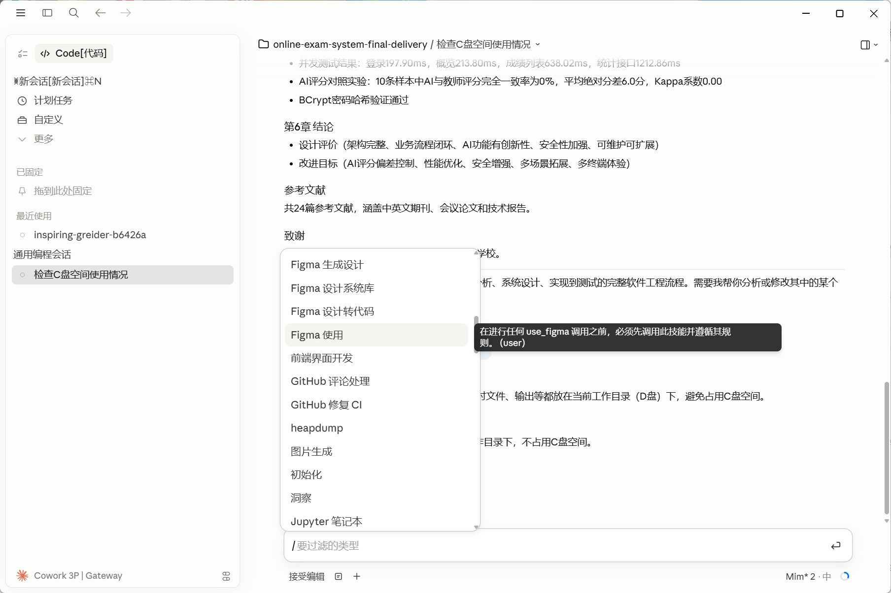

# Claude Code 中文增强工具箱

Windows 便携版 Claude / Codex 桌面端中文增强项目。  
这个项目把 **桌面端界面汉化** 和 **Slash 技能列表自动中文化** 整理到一起，方便别人拉取仓库后直接使用。

---

## 项目目标

这个项目主要解决两类问题：

1. **Claude/Codex 桌面端界面仍有大量英文**
2. **`/` Slash 技能列表、悬停说明、后续新增技能不会自动变成中文**

本项目的目标是：

- 让桌面端界面尽量显示中文
- 让 Slash 技能列表尽量显示中文
- 让 tooltip / 悬停说明尽量显示中文
- 让新增技能也可以自动进入中文显示
- 尽量不影响原本功能调用

---

## 效果图

下面这张就是当前项目在本机实际生效的效果图：桌面端界面已中文化，/ 技能列表与悬停说明也会尽量显示中文。



---

## 功能特性

- 桌面端显示层中文增强
- Slash 技能列表中文化
- 悬停说明 / tooltip 中文化
- 已知技能固定映射中文
- 漏网英文自动翻译
- 自动翻译结果本地缓存
- 新增技能自动同步中文名称与说明
- 开机后自动监控技能目录变化

---

## 适用环境

目前更适合以下场景：

- Windows 系统
- Claude / Codex **便携版桌面端**
- 本地已存在可运行的桌面端目录
- 本地安装了 Python

> 更准确地说，这个项目当前主要围绕 **Windows 便携版 Claude/Codex 桌面端** 做适配。

---

## 我推荐的仓库描述

你可以在 GitHub 仓库描述里使用这句：

> Windows portable Claude/Codex desktop Chinese localization toolkit: UI translation, slash skill localization, tooltip auto-translation cache, and automatic Chinese sync for newly added skills.

中文也可以写成：

> Windows 便携版 Claude/Codex 桌面端中文增强工具箱：界面汉化、Slash 技能列表中文化、tooltip 自动翻译缓存、新增技能自动同步中文。

---

## 项目结构

```text
claude-code-zh-toolkit/
├─ desktop/
│  └─ skill-display-patch.js
├─ docs/
│  ├─ how-it-works.md
│  └─ images/
│     ├─ effect-1.png
│     ├─ effect-2.png
│     └─ effect-3.png
├─ scripts/
│  ├─ install_portable_zh.ps1
│  └─ sync_once.cmd
├─ skills/
│  ├─ sync_skill_chinese.py
│  ├─ skill_chinese_overrides.json
│  ├─ skill_chinese_state.json
│  └─ skill_display_map.json
└─ README.md
```

### 各目录说明

#### `desktop/skill-display-patch.js`

前端显示层补丁，负责：

- 替换技能列表英文名称
- 替换 tooltip / title / aria-label
- 对漏网英文自动翻译
- 把自动翻译结果持久缓存到本地

#### `skills/sync_skill_chinese.py`

技能中文同步器，负责：

- 扫描 `~/.codex/skills`
- 扫描 `~/.codex/plugins`
- 自动翻译技能英文名和说明
- 写入 `display_name` / `short_description`
- 生成 `技能作用.txt`
- 输出前端显示映射 `skill_display_map.json`

#### `scripts/install_portable_zh.ps1`

安装脚本，负责：

- 把补丁复制到目标便携版目录
- 给前端页面注入补丁脚本
- 安装技能中文同步器
- 创建开机自启 watcher
- 立即同步一次技能中文

#### `scripts/sync_once.cmd`

手动同步一次技能中文的快捷入口。

---

## 安装方法

### 第一步：准备便携版目录

你需要先有一个已经能运行的 Claude / Codex 便携版目录。  
例如：

```text
D:\ClaudeZhCN\Claude
```

这个目录下面应该能看到：

```text
resources\ion-dist
```

也就是说，你传给安装脚本的目录，应该是 **包含 `resources\ion-dist` 的那个根目录**。

---

### 第二步：克隆仓库

```powershell
git clone https://github.com/LinYiXin123/claude-code-zh-toolkit.git
cd claude-code-zh-toolkit
```

---

### 第三步：运行安装脚本

示例：

```powershell
powershell -ExecutionPolicy Bypass -File .\scripts\install_portable_zh.ps1 -PortableRoot "D:\ClaudeZhCN\Claude"
```

安装脚本会自动：

- 复制 `skill-display-patch.js`
- 安装技能中文同步器到 `~/.codex/tools/skill-chinese`
- 修改便携版 `index.html`
- 创建开机自启 watcher
- 立即同步一次技能中文

---

## 使用方式

### 1. 安装完成后直接启动桌面端

打开你的 Claude / Codex 便携版桌面端，输入 `/`：

- 技能列表会尽量显示中文
- tooltip / 悬停说明会尽量显示中文

### 2. 如果有漏网英文

第一次看到某些陌生英文项时：

- 前端补丁会尝试自动翻译
- 自动翻译结果会缓存到本地
- 以后再看到时会优先显示中文

### 3. 新增技能后

如果用户后来往 `~/.codex/skills` 或 `~/.codex/plugins` 里新增技能：

- watcher 会自动检测到变化
- `sync_skill_chinese.py` 会重新生成中文映射
- 重启应用后，新增技能也能尽量显示中文

---

## 手动同步一次技能中文

如果想手动执行一次同步，可以直接双击：

```text
scripts\sync_once.cmd
```

或者运行：

```powershell
python .\skills\sync_skill_chinese.py --once
```

---

## 自定义翻译

你可以手动编辑：

```text
skills/skill_chinese_overrides.json
```

用于覆盖某些技能名或说明。

例如：

```json
{
  "skills": {
    "your-skill-name": {
      "display_name": "你的技能中文名",
      "short_description": "你的技能中文说明"
    }
  },
  "plugins": {}
}
```

---

## 实现原理

这个项目不是简单替换一份翻译文件，而是分成两层：

### 1）桌面端显示层汉化

通过在前端页面注入 `skill-display-patch.js`：

- 监听 DOM 变化
- 替换技能名称
- 替换 tooltip / `title` / `aria-label`
- 对未覆盖英文做自动翻译
- 把翻译结果缓存到浏览器本地存储

这属于 **显示层补丁**：

- 不改真实技能 ID
- 不改真实命令名
- 不影响原本功能调用
- 主要改变“用户看到的文字”

### 2）技能元数据中文同步

通过 `sync_skill_chinese.py`：

- 扫描技能目录
- 读取 `SKILL.md`、`openai.yaml`、`plugin.json`
- 自动补中文 `display_name`
- 自动补中文 `short_description`
- 生成 `技能作用.txt`
- 生成前端补丁读取的 `skill_display_map.json`

### 3）为什么新增技能也能自动中文

因为安装后会创建一个 watcher：

- 开机自动运行
- 轮询检测技能目录变化
- 一旦新增或修改技能，就重新生成中文映射

所以：

- 新技能加入后，不需要手工一条条补
- 关机、重启后仍然能继续工作

---

## 适合什么用户

这个项目适合：

- 想把 Windows 便携版 Claude/Codex 做中文增强的人
- 想把技能列表也一起中文化的人
- 想做成“别人拉仓库就能复现”的项目维护者

---

## 当前限制

请注意：

- 不同版本的便携版前端结构可能不同
- 如果官方前端后续大改，`index.html` 注入点可能需要重新适配
- 某些非常晚加载、远端注入、或版本特有的内部命令，第一次出现时可能仍会短暂显示英文
- 这类漏网项通常会在自动翻译与缓存后逐渐收口

---

## 后续可扩展方向

未来可以继续做的内容：

- 增加卸载脚本
- 增加 GUI 安装器
- 增加更多内置命令固定映射
- 增加版本检测和兼容提示
- 增加便携版路径自动发现逻辑

---

## 致谢

这个项目是在实际中文化 Windows 便携版 Claude/Codex 桌面端的过程中逐步整理出来的，目标是把“个人本机补丁”沉淀成“别人也能直接复用的项目”。

---

## 一句话介绍

> 一个面向 Windows 便携版 Claude/Codex 桌面端的中文增强工具箱，包含界面显示层汉化、Slash 技能列表中文化、tooltip 自动翻译缓存，以及新增技能自动同步中文能力。

